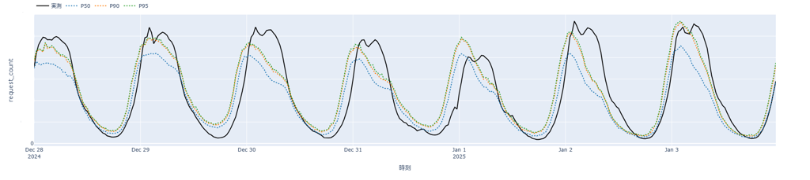
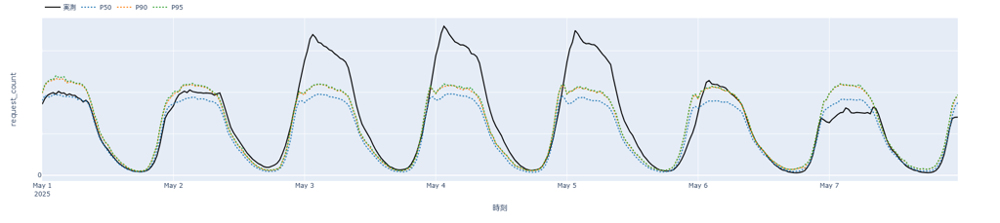
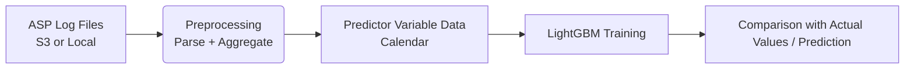
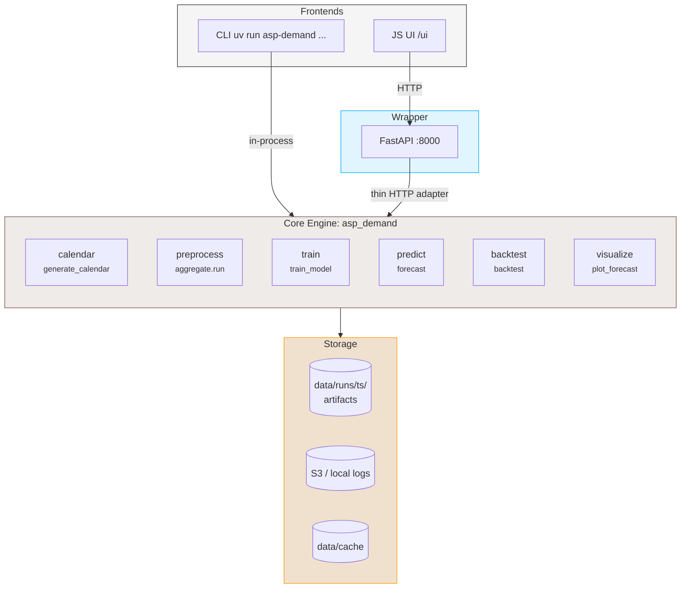
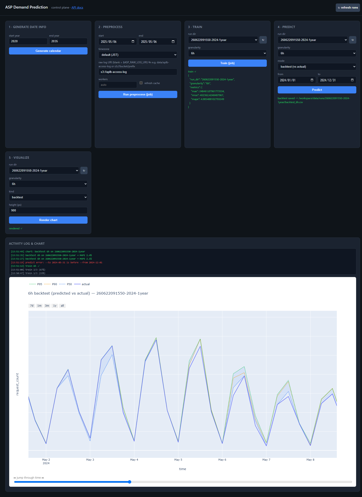
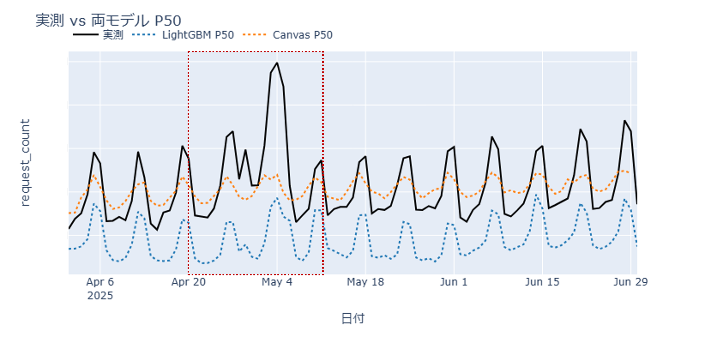
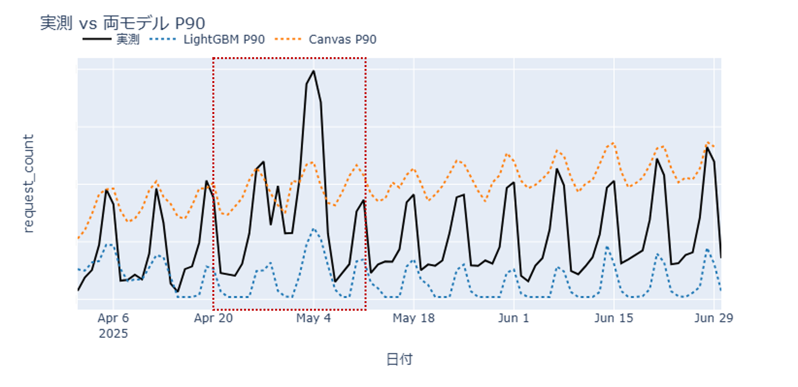
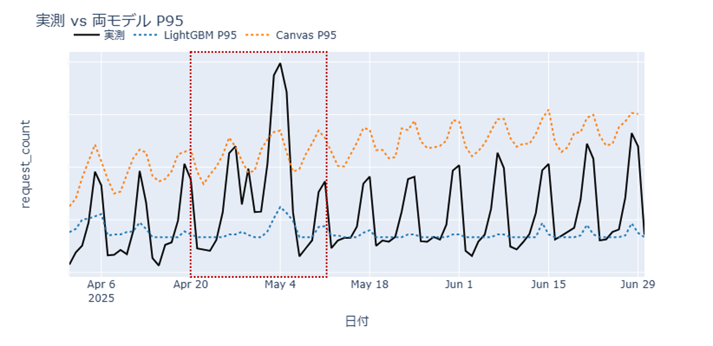
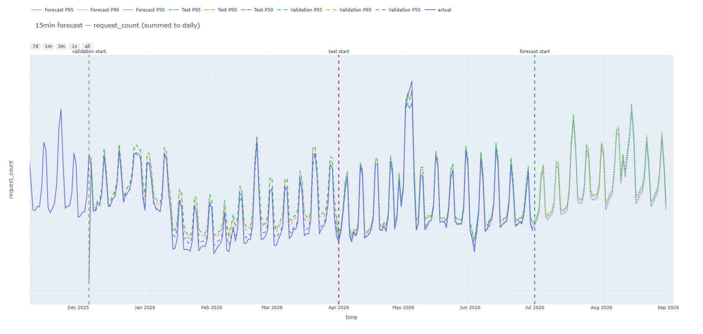

# ServiceDemandForecast

Service Demand Forecast via Application Service Providing w/ LightGBM

13.Jul.2026 - 23.Jul.2024

## Ⅰ. Objective

Goal to achieve:

1. Enable automated system-based forecasting of access volume and API usage patterns (identifying users and usage volume).

2. Continuously display forecasts covering the next three months on an office dashboard

3. Decide whether to scale up servers based on predicted spikes in access volume. (Excess server capacity relative to actual demand incurs wasteful costs, which we aim to minimize.)
   
   * The peak RPS (requests per second) value is a key metric.

## Ⅱ. Problem Identification

1. High cost of AWS SageMaker Canvas
   
   | Service Name | May 2026  | June 2026 |
   | ------------ | --------- | --------- |
   | SageMaker    | $1,095.62 | $1,312.40 |
   | Athena       | $19.71    | $25.17    |

2. While the Canvas offers the convenience of automation and infrastructure management, it entails a loss of control over the model
   
   * As shown below, despite discrepancies between predicted and actual values ​​during the year-end/New Year holidays (based on two years of training data) and Golden Week (based on one year of training data), it was not possible to control for exogenous variables:
   * ❗actual values masked; shape illustrative
   * ❗actual values masked; shape illustrative

## Ⅲ. Trade-off

### A. Canvas vs. OSS

1. While Canvas offers the convenience of automation and infrastructure management, it comes at the cost of fixed monthly expenses and a loss of control over the model. For a team with engineers, **the convenience of automation was less critical** than factors such as cost, control, and scalability.

2. By utilizing idle resources of existing infrastructure, the marginal cost is nearly zero.

### B. OSS Comparison: Prophet vs. LightGBM

**LightGBM holds the advantage in training performance, training speed, and scalability.**

#### 1. Ability to handle "non-linear interactions" among external variables (e.g., weather)

- Prophet: While external variables can be added (`add_regressor`), by default, they are incorporated only in a linear or simple additive manner. For instance, it learns only at the level of "connection volume decreases by N when it rains."

- LightGBM: As a tree-based model, it automatically captures complex interactions between variables. For example, It can fully learn complex conditions—such as "delivery app usage and indoor service logs spike when it rains on a weekend (calendar), whereas traffic logs for commuting routes spike when it rains on a weekday (calendar)"—through tree splits.

#### 2. Handling diverse periodicities (hourly to 24-hour cycles)

When dealing with sub-daily predictions (e.g., 1-hour or 3-hour intervals), <u>LightGBM</u> handles this simply by incorporating derived variables like `hour` or `time_of_day` into its tree branches. In contrast, Prophet requires internal adjustments to Fourier series when processing hourly data, which can make tuning difficult and complex.

#### 3. Efficiency of learning additional data (model updates)

- Prophet: Does not officially support online learning. When new data arrives, the model must be refitted from scratch using both the new and historical data. As data accumulates over several years, training speed slows down significantly.

- LightGBM: Offers overwhelmingly fast training speeds, even with large datasets. When new data is added, you can: 1) Periodically retrain the model on the entire dataset using a sliding window approach (e.g., the most recent 1–2 years) at very high speed; or 2) Use the `init_model` argument to perform incremental learning (warm start) by adding new data to the existing trained trees.

## Ⅳ. Design and Implementation

### A. Definition of the actual work process (data flow)

Configure the existing 'AWS Athena (data preprocessing) → SageMaker Canvas (model training and validation)' pipeline with the following data flow and design.



### B.System Design

#### 1. Architecture

A single **core engine** (providing basic functionality) is driven by two
**front-ends**: the JS UI communicates with FastAPI (a lightweight wrapper) via HTTP,
while the CLI invokes the engine directly within the process.
FastAPI also serves as the **back-end for the JS UI** and can handle requests via 'curl'.



#### 2. Calendar Data Example

```csv
date,holiday_name,weekday,is_weekend,is_holiday,is_business_day,day_before_holiday,day_after_holiday,in_long_weekend,is_nenmatsu

...

2024-04-22,,0,0,0,1,0,0,0,0
2024-04-23,,1,0,0,1,0,0,0,0
2024-04-24,,2,0,0,1,0,0,0,0
2024-04-25,,3,0,0,1,0,0,0,0
2024-04-26,,4,0,0,1,0,0,0,0
2024-04-27,,5,1,0,0,0,0,1,0
2024-04-28,,6,1,0,0,1,0,1,0
2024-04-29,昭和の日,0,0,1,0,0,0,1,0
2024-04-30,,1,0,0,1,0,1,0,0
2024-05-01,,2,0,0,1,0,0,0,0
2024-05-02,,3,0,0,1,1,0,0,0
2024-05-03,憲法記念日,4,0,1,0,1,0,1,0
2024-05-04,みどりの日,5,1,1,0,1,1,1,0
2024-05-05,こどもの日,6,1,1,0,1,1,1,0
2024-05-06,こどもの日 振替休日,0,0,1,0,0,1,1,0
2024-05-07,,1,0,0,1,0,1,0,0
2024-05-08,,2,0,0,1,0,0,0,0
2024-05-09,,3,0,0,1,0,0,0,0
2024-05-10,,4,0,0,1,0,0,0,0
2024-05-11,,5,1,0,0,0,0,0,0
2024-05-12,,6,1,0,0,0,0,0,0
2024-05-13,,0,0,0,1,0,0,0,0
2024-05-14,,1,0,0,1,0,0,0,0
2024-05-15,,2,0,0,1,0,0,0,0

...
```

#### 3. Example of the actual running screen

❗actual values masked; shape illustrative


## Ⅴ. Performance comparison; LightGBM vs. Canvas

Training data period: 2024 + Jan–March 2025

Training data interval: Daily

Forecast period: April–June 2025

|                                                                          | **LightGBM** | **Canvas**   |
| ------------------------------------------------------------------------ | ------------ | ------------ |
| MAPE                                                                     | **0.085**    | 0.093        |
| WAPE                                                                     | **0.09**     | 0.091        |
| MASE                                                                     | **0.958**    | 1.026        |
| RMSE (relative to Canvas)                                                | +6.8%        | — (baseline) |
| ❗**RMSE: lower is better. LightGBM's RMSE was 6.8% higher than Canvas.** |              |              |

**Conclusion**

LightGBM outperformed other models across general accuracy metrics (MAPE, WAPE, MASE). Notably, Canvas failed to even surpass the simple forecast baseline (1.0) in terms of MASE. However, since the project's actual KPI was prediction accuracy for peak RPS (requests per second)—a metric where Canvas held a slight edge due to its sensitivity to peak errors—LightGBM was ultimately selected; this decision was driven by considerations of cost and scalability, as well as Canvas's inability to capture specific predictive trends.

- Actual Measurement vs. Both Models (P50)

- Actual Measurement vs. Both Models (P90)
  ❗actual values masked; shape illustrative
  

- Actual Measurement vs. Both Models (P95)
  ❗actual values masked; shape illustrative
  

### Ⅵ. Result

| Service Name | May 2026  | June 2026 | July 2026 |
| ------------ | --------- | --------- | --------- |
| SageMaker    | $1,095.62 | $1,312.40 | $26.98    |
| Athena       | $19.71    | $25.17    | $4.57     |

This library has been adopted by the team and is undergoing further development and performance improvements; July costs via AWS amounted to 'Sagemaker: -$1,285.42 Athena: -\$20.60 ', representing each 'Sagemaker: -97.94%, Athena: -81.84%' reduction.

Afterwards, I handed it over to the team member originally responsible for it.

Example of the team member's work result:

- Training data: 2024-09-01–2025-12-05

- Validation data: 2025-12-05–2026-03-31

- Test data: 2026-04-01–2026-06-30

- Granularity (Training data interval): 15 min

- ❗actual values masked; shape illustrative 
